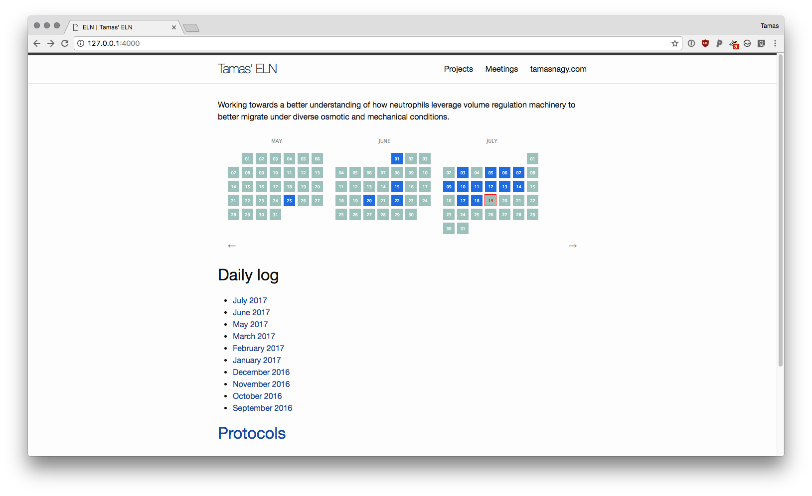
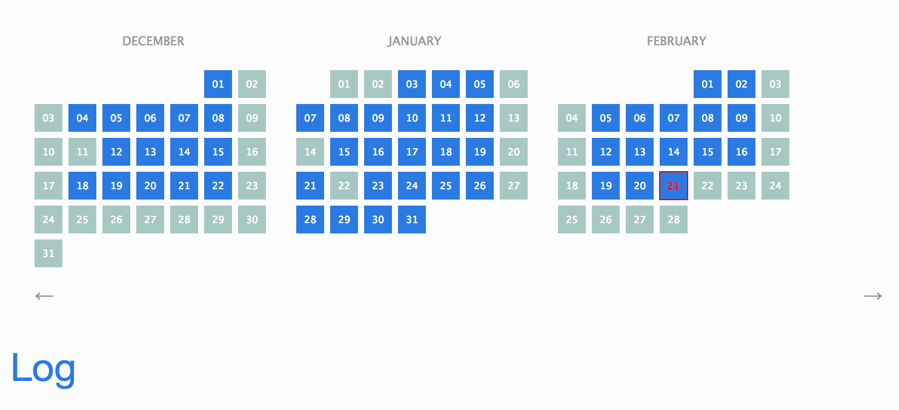

# 2017.10.04

Add an example of embedding csvs to the demo!



# 2017.07.18 #test

- Maybe I should have done something today?



# 2017.07.19 #test #test2

- [ ] Write my first log entry
- [ ] Second thing to do



- [ ] Another thing to do




# 2018.02.21 #meta #test2

- [x] Finally got around to deploying the live demo!



- You can also tag daily entries with project names like `#meta` or `#test2`. These project names cannot have spaces. You can see posts categorized according to these tags under [Projects](../../projects/). It looks something like this:

```
# 2018.02.21 #meta #test2
```

#### Section

- You can have sections and images



- You can use my plugin for Atom, [`atom-markdown-image-assistant`](https://github.com/tlnagy/atom-markdown-image-assistant) to quickly insert images into your lab notebook.

- You can also include nice formatted code:

```julia
f(x) = x + x^2

"""
This is a Julia function
"""
function g()
    result = 0
    for i in 1:1000
        result += f(i)
    end
    result
end
```
