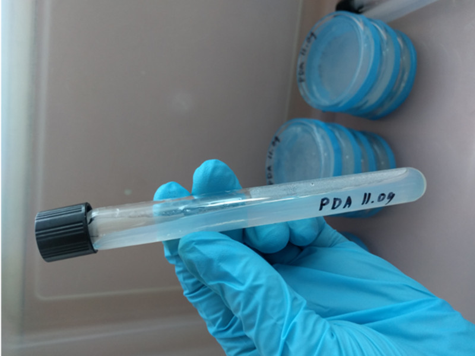
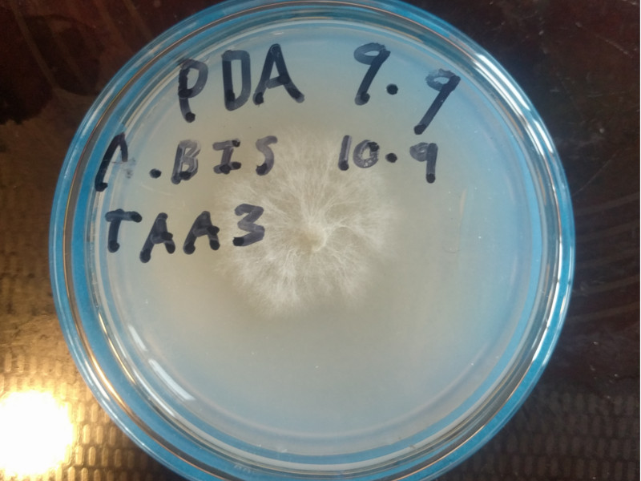
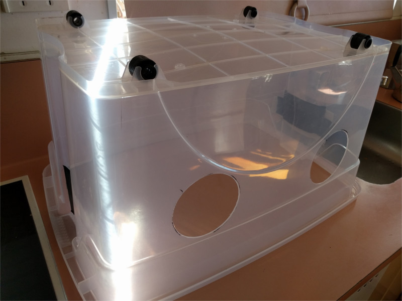

# 2021.09.09 #mussy  

New PDA mix with Alt recipe 2  
Discarded 3/4 TAA2  
Discarded 1/2 TDA2  

Premixed and autoclaved mixture with empty dishes.  
Sterilised for `20min` on `low` setting with `1L of water`.  
Stirred then poured at 50c.  



# 2021.09.10 #mussy  

Transferred out A.Bis:  
TDA1 03.08 -> TDA2 10.09 x3  
TAA2 14.08 -> TAA3 10.09 x2  
TDA2 14.08 -> TDA3 10.09 x2  

# 2021.09.11  

Made up slants for the first time.
Also new PDA plates.



`15mm Ø x 100mm slants with 7ml of PDA media`



# 2021.09.13  

Remade all of the previous plates and slants from 11/09, this time with the correct recipe. ㅇㅅㅇ)


# 2021.09.17  

Discarded TDA3 10.09 x2,TAD2 14.08  
Update from 13/09: 3 of 11 new clean plates contaminated   

# 2021.09.19  
Transferred out A.Bis:  
TDA2 10.09 -> TDA3 19.09  
TDA2 10.09 -> TDA3 19.09  

Update from 13/09: 9 of 11 clean plates & 1 of 5 slants contaminated, discarded.  

> 
> Our first clean mono culture (I think)





# 2021.09.20  



  >   
  > New still air box  

# 2021.09.24  
Transferred out A.Bis:   
TDA3 -> TDA4 24.09  
TDA3 -> TDA4 24.09  
TAA3 -> TAA4 24.09 x4  

Update from 20/09: 11 of 17 plates contaminated, discarded.  


